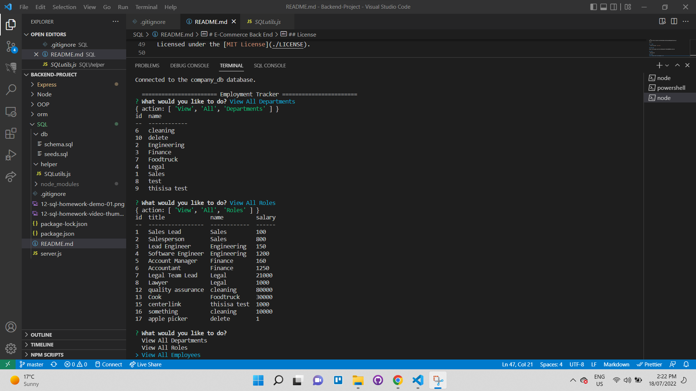

# E-Commerce Back End

 

## Introduction

This a Javascript command-line application that views and interacts with infromation stored in the SQL database. The company has three tables. Department, Roles and Employee

This CLI application uses npm package `Sequelize` and `mysql2`.

I made this app in order to learn how to implement a database model using Sequelize.

## Installation

### 0. Required

| Programs | Download links                  |
| -------- | ------------------------------- |
| `Node`   | https://nodejs.org/en/download/ |
| `Mysql`  | https://dev.mysql.com/          |

### 1. Git clone and go inside

```sh
git clone https://github.com/s3793758/HW12-SQL-EmployeeManagementSystem.git

cd sql
```

## 2. Usage

1. Start the server: `npm start`

## Video Demo

https://drive.google.com/file/d/1V6K1aqzZbLY-7StBjJ5QOXHNOkS_lbnZ/view



## Credits

- BCS Resources

## License

&copy; Muhamad Sahid <mas152q@gmail.com>

Licensed under the [MIT License](./LICENSE).
